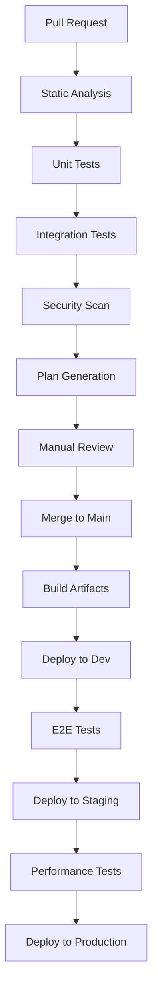

> **📚 Series Navigation:**
>
> - [Part 1: Getting Started with Terraform for PowerShell People](/posts/GettingStartedWithTerraformForPowerShellPeople/)
> - [Part 2: Resources, Variables, and State in Terraform](/posts/ResourcesVariablesAndStateInTerraform/)
> - [Part 3: Advanced Terraform and PowerShell Integration](/posts/AdvancedTerraformAndPowerShellIntegration/)
> - [Part 4: Advanced State Management and Collaboration](/posts/AdvancedStateManagementAndCollaboration/)
> - [Part 5: Testing Terraform Code](/posts/TestingTerraformCode/)
> - [Part 6: Terraform Modules Deep Dive](/posts/TerraformModulesDeepDive/)
> - **Part 7: CI/CD with GitHub Actions** ← *You are here*

## Building Enterprise-Grade CI/CD Pipelines for Terraform

Welcome to the final installment of our comprehensive 7-part series on Terraform for PowerShell developers! Throughout this journey, we've progressed from basic concepts to enterprise-grade infrastructure management. Now, we'll bring everything together by implementing robust CI/CD pipelines using GitHub Actions.

As PowerShell professionals who've likely worked with Azure DevOps, Jenkins, or other CI/CD tools, you'll find GitHub Actions provides familiar concepts with modern, cloud-native approaches. In this final part, we'll create pipelines that incorporate:

- The testing strategies from [Part 5](/posts/TestingTerraformCode/)
- The modular design patterns from [Part 6](/posts/TerraformModulesDeepDive/)
- The state management techniques from [Part 4](/posts/AdvancedStateManagementAndCollaboration/)
- The PowerShell integration patterns from [Part 3](/posts/AdvancedTerraformAndPowerShellIntegration/)

Together, these create a complete enterprise infrastructure automation platform.

## Enterprise CI/CD Pipeline Architecture for Terraform

A comprehensive Terraform CI/CD pipeline for enterprise environments should include multiple stages that align with the testing pyramid we discussed in Part 5:

### Pipeline Stages Overview



### PowerShell CI/CD vs. GitHub Actions Comparison

| Stage          | PowerShell (Azure DevOps) | GitHub Actions                 | Terraform Integration         |
| -------------- | ------------------------- | ------------------------------ | ----------------------------- |
| **Validation** | `Invoke-Pester`           | `.tftest.hcl` + native testing | Built-in Terraform commands   |
| **Linting**    | `PSScriptAnalyzer`        | TFLint, Checkov                | Multiple specialized tools    |
| **Testing**    | Pester + custom scripts   | Native Terraform testing       | `.tftest.hcl` files           |
| **Planning**   | Custom PowerShell         | `terraform plan` + PR comments | Native plan integration       |
| **Approval**   | Manual gates              | Environment protection rules   | GitHub native approvals       |
| **Deployment** | PowerShell DSC/ARM        | `terraform apply`              | Direct infrastructure changes |

### Pipeline Components

1. **Pull Request Validation**: Static analysis, unit tests, security scanning
2. **Plan Generation**: Create and review infrastructure changes
3. **Automated Testing**: Integration and end-to-end tests using native framework
4. **Documentation**: Auto-generate module docs and changelogs
5. **Multi-Environment Deployment**: Progressive deployment with gates
6. **Monitoring Integration**: Post-deployment verification and alerting

## Setting Up GitHub Actions for Terraform

First, create a `.github/workflows` directory in your repository:

```powershell
New-Item -ItemType Directory -Path .github/workflows -Force
```

## Pull Request Workflow with Native Testing

This comprehensive workflow integrates all the testing strategies we've covered in the series:

```yml
# .github/workflows/terraform-pr.yml
name: "Terraform Pull Request Validation"

on:
  pull_request:
    paths:
      - '**.tf'
      - '**.tftest.hcl'
      - '**.tfvars'
      - '.github/workflows/terraform-pr.yml'

permissions:
  contents: read
  pull-requests: write
  security-events: write

env:
  TF_VERSION: "1.7.0"
  TF_LOG: INFO

jobs:
  changes:
    name: "Detect Changes"
    runs-on: ubuntu-latest
    outputs:
      terraform: ${{ steps.changes.outputs.terraform }}
      modules: ${{ steps.changes.outputs.modules }}
      tests: ${{ steps.changes.outputs.tests }}
    steps:
      - name: Checkout
        uses: actions/checkout@v4

      - name: Detect Changes
        uses: dorny/paths-filter@v2
        id: changes
        with:
          filters: |
            terraform:
              - '**.tf'
              - '**.tfvars'
            modules:
              - 'modules/**'
            tests:
              - '**.tftest.hcl'
              - 'tests/**'

  static-analysis:
    name: "Static Analysis"
    runs-on: ubuntu-latest
    needs: changes
    if: needs.changes.outputs.terraform == 'true'
    steps:
      - name: Checkout
        uses: actions/checkout@v4

      - name: Setup Terraform
        uses: hashicorp/setup-terraform@v3
        with:
          terraform_version: ${{ env.TF_VERSION }}

      - name: Terraform Format Check
        id: fmt
        run: terraform fmt -check -recursive
        continue-on-error: true

      - name: Terraform Init (No Backend)
        id: init
        run: terraform init -backend=false

      - name: Terraform Validate
        id: validate
        run: terraform validate

      - name: Setup TFLint
        uses: terraform-linters/setup-tflint@v4
        with:
          tflint_version: v0.47.0

      - name: Initialize TFLint
        run: tflint --init
        env:
          GITHUB_TOKEN: ${{ github.token }}

      - name: Run TFLint
        run: tflint -f compact

      - name: Run Checkov Security Scan
        id: checkov
        uses: bridgecrewio/checkov-action@master
        with:
          directory: .
          framework: terraform
          output_format: sarif
          output_file_path: reports/results.sarif
          download_external_modules: true

      - name: Upload Checkov Results to GitHub Security
        uses: github/codeql-action/upload-sarif@v2
        if: always()
        with:
          sarif_file: reports/results.sarif

      - name: Post Static Analysis Results
        if: always()
        uses: actions/github-script@v7
        with:
          script: |
            const output = `#### Terraform Static Analysis Results 📋

            | Check              | Status                                                |
            | ------------------ | ----------------------------------------------------- |
            | Format             | ${{ steps.fmt.outcome == 'success' && '✅ Passed'      |  | '❌ Failed' }}       |
            | Validate           | ${{ steps.validate.outcome == 'success' && '✅ Passed' |  | '❌ Failed' }}       |
            | TFLint             | ${{ job.status == 'success' && '✅ Passed'             |  | '❌ Failed' }}       |
            | Security (Checkov) | ${{ steps.checkov.outcome == 'success' && '✅ Passed'  |  | '⚠️ Issues Found' }} |

            ${{ steps.fmt.outcome != 'success' && '\n**Format Issues Found:**\nRun `terraform fmt -recursive` to fix formatting issues.\n' || '' }}

            <details><summary>View detailed security scan results</summary>

            Security scan completed. Check the Security tab for detailed findings.

            </details>`;

            github.rest.issues.createComment({
              issue_number: context.issue.number,
              owner: context.repo.owner,
              repo: context.repo.repo,
              body: output
            });

  unit-tests:
    name: "Unit Tests (Native)"
    runs-on: ubuntu-latest
    needs: [changes, static-analysis]
    if: needs.changes.outputs.terraform == 'true' || needs.changes.outputs.tests == 'true'
    strategy:
      matrix:
        test-path: [
          "tests/unit",
          "modules/*/tests"
        ]
    steps:
      - name: Checkout
        uses: actions/checkout@v4

      - name: Setup Terraform
        uses: hashicorp/setup-terraform@v3
        with:
          terraform_version: ${{ env.TF_VERSION }}

      - name: Find Test Files
        id: find-tests
        run: |
          if [ -d "${{ matrix.test-path }}" ]; then
            test_files=$(find ${{ matrix.test-path }} -name "*.tftest.hcl" -type f)
            if [ -n "$test_files" ]; then
              echo "tests_found=true" >> $GITHUB_OUTPUT
              echo "test_files<<EOF" >> $GITHUB_OUTPUT
              echo "$test_files" >> $GITHUB_OUTPUT
              echo "EOF" >> $GITHUB_OUTPUT
            else
              echo "tests_found=false" >> $GITHUB_OUTPUT
            fi
          else
            echo "tests_found=false" >> $GITHUB_OUTPUT
          fi

      - name: Run Native Terraform Tests
        if: steps.find-tests.outputs.tests_found == 'true'
        run: |
          echo "Running tests in ${{ matrix.test-path }}"
          cd $(dirname ${{ matrix.test-path }})
          terraform test -verbose

  integration-tests:
    name: "Integration Tests"
    runs-on: ubuntu-latest
    needs: [changes, unit-tests]
    if: needs.changes.outputs.modules == 'true'
    environment: development
    steps:
      - name: Checkout
        uses: actions/checkout@v4

      - name: Setup Terraform
        uses: hashicorp/setup-terraform@v3
        with:
          terraform_version: ${{ env.TF_VERSION }}

      - name: Configure Azure Credentials
        uses: azure/login@v1
        with:
          creds: ${{ secrets.AZURE_CREDENTIALS }}

      - name: Run Integration Tests
        run: |
          if [ -d "tests/integration" ]; then
            cd tests/integration
            terraform test -verbose
          else
            echo "No integration tests found"
          fi

  terraform-plan:
    name: "Terraform Plan"
    runs-on: ubuntu-latest
    needs: [changes, static-analysis, unit-tests]
    if: needs.changes.outputs.terraform == 'true'
    environment: development
    steps:
      - name: Checkout
        uses: actions/checkout@v4

      - name: Setup Terraform
        uses: hashicorp/setup-terraform@v3
        with:
          terraform_version: ${{ env.TF_VERSION }}

      - name: Configure Backend
        run: |
          cat > backend.tf << EOF
          terraform {
            backend "azurerm" {
              resource_group_name  = "${{ secrets.STATE_RESOURCE_GROUP }}"
              storage_account_name = "${{ secrets.STATE_STORAGE_ACCOUNT }}"
              container_name       = "${{ secrets.STATE_CONTAINER }}"
              key                  = "pr-${{ github.event.number }}.tfstate"
            }
          }
          EOF

      - name: Configure Azure Credentials
        uses: azure/login@v1
        with:
          creds: ${{ secrets.AZURE_CREDENTIALS }}

      - name: Terraform Init
        id: init
        run: terraform init

      - name: Terraform Plan
        id: plan
        run: |
          terraform plan -no-color -out=tfplan
          terraform show -no-color tfplan > plan_output.txt
        continue-on-error: true

      - name: Generate Plan Summary
        id: plan-summary
        run: |
          # Create a more readable plan summary
          echo "PLAN_SUMMARY<<EOF" >> $GITHUB_OUTPUT
          echo "## Terraform Plan Summary" >> $GITHUB_OUTPUT
          echo "" >> $GITHUB_OUTPUT

          # Extract resource changes
          if grep -q "Plan:" plan_output.txt; then
            grep "Plan:" plan_output.txt >> $GITHUB_OUTPUT
          else
            echo "No changes detected" >> $GITHUB_OUTPUT
          fi

          echo "" >> $GITHUB_OUTPUT
          echo "### Resource Changes:" >> $GITHUB_OUTPUT

          # Count changes by type
          to_add=$(grep -c "will be created" plan_output.txt || echo "0")
          to_change=$(grep -c "will be updated" plan_output.txt || echo "0")
          to_destroy=$(grep -c "will be destroyed" plan_output.txt || echo "0")

          echo "- 🟢 **To Add:** $to_add" >> $GITHUB_OUTPUT
          echo "- 🟡 **To Change:** $to_change" >> $GITHUB_OUTPUT
          echo "- 🔴 **To Destroy:** $to_destroy" >> $GITHUB_OUTPUT
          echo "EOF" >> $GITHUB_OUTPUT

      - name: Update Pull Request with Plan
        uses: actions/github-script@v7
        env:
          PLAN: "${{ steps.plan.outputs.stdout }}"
          PLAN_SUMMARY: "${{ steps.plan-summary.outputs.PLAN_SUMMARY }}"
        with:
          github-token: ${{ secrets.GITHUB_TOKEN }}
          script: |
            const fs = require('fs');
            const planOutput = fs.readFileSync('plan_output.txt', 'utf8');

            const output = `#### Terraform Plan 📝 \`${{ steps.plan.outcome }}\`

            ${{ steps.plan-summary.outputs.PLAN_SUMMARY }}

            <details><summary>Show Full Plan</summary>

            \`\`\`terraform
            ${planOutput}
            \`\`\`

            </details>

            *Plan generated for PR #${{ github.event.number }} at commit ${{ github.sha }}*`;

            // Find existing plan comment
            const comments = await github.rest.issues.listComments({
              issue_number: context.issue.number,
              owner: context.repo.owner,
              repo: context.repo.repo,
            });

            const existingComment = comments.data.find(comment =>
              comment.body.includes('#### Terraform Plan 📝')
            );

            if (existingComment) {
              await github.rest.issues.updateComment({
                comment_id: existingComment.id,
                owner: context.repo.owner,
                repo: context.repo.repo,
                body: output
              });
            } else {
              await github.rest.issues.createComment({
                issue_number: context.issue.number,
                owner: context.repo.owner,
                repo: context.repo.repo,
                body: output
              });
            }

      - name: Terraform Plan Status
        if: steps.plan.outcome == 'failure'
        run: exit 1

  cost-estimation:
    name: "Cost Estimation"
    runs-on: ubuntu-latest
    needs: terraform-plan
    if: needs.changes.outputs.terraform == 'true'
    steps:
      - name: Checkout
        uses: actions/checkout@v4

      - name: Setup Infracost
        uses: infracost/actions/setup@v2
        with:
          api-key: ${{ secrets.INFRACOST_API_KEY }}

      - name: Generate Infracost Diff
        run: |
          infracost breakdown --path . --format json --out-file /tmp/infracost-base.json
          infracost diff --path . --compare-to /tmp/infracost-base.json --format json --out-file /tmp/infracost-diff.json

      - name: Post Cost Comment
        run: |
          infracost comment github --path /tmp/infracost-diff.json \
            --repo $GITHUB_REPOSITORY \
            --github-token ${{ secrets.GITHUB_TOKEN }} \
            --pull-request ${{ github.event.number }} \
            --behavior update
```

## Release Drafter Workflow

Next, let's implement a release drafter that creates and updates release notes based on merged PRs:

```yml
# filepath: .github/workflows/release-drafter.yml
name: Release Drafter

on:
  push:
    branches:
      - main
      - master
  workflow_dispatch:

permissions:
  contents: write
  pull-requests: read

jobs:
  draft-release:
    runs-on: ubuntu-latest
    steps:
      - uses: release-drafter/release-drafter@v5
        with:
          config-name: release-drafter-config.yml
        env:
          GITHUB_TOKEN: ${{ secrets.GITHUB_TOKEN }}

  terraform-validate:
    name: "Terraform Validate"
    runs-on: ubuntu-latest
    steps:
      - name: Checkout
        uses: actions/checkout@v4

      - name: Setup Terraform
        uses: hashicorp/setup-terraform@v3
        with:
          terraform_version: "1.7.0"

      - name: Terraform Init
        id: init
        run: terraform init -backend=false

      - name: Terraform Validate
        id: validate
        run: terraform validate

      - name: Terraform Plan
        id: plan
        run: terraform plan -no-color
```

## Add a release drafter configuration file

```yml
# filepath: .github/release-drafter-config.yml
name-template: 'v$RESOLVED_VERSION'
tag-template: 'v$RESOLVED_VERSION'
categories:
  - title: '🚀 Features'
    labels:
      - 'feature'
      - 'enhancement'
  - title: '🐛 Bug Fixes'
    labels:
      - 'fix'
      - 'bugfix'
      - 'bug'
  - title: '🧰 Maintenance'
    labels:
      - 'chore'
      - 'documentation'

change-template: '- $TITLE @$AUTHOR (#$NUMBER)'

version-resolver:
  major:
    labels:
      - 'major'
  minor:
    labels:
      - 'minor'
  patch:
    labels:
      - 'patch'
  default: patch

template: |
  ## Changes

  $CHANGES

  ## Contributors

  $CONTRIBUTORS
```

## Deployment Workflow

Finally, let's create a workflow that applies Terraform changes when a new release is published:

```yml
# filepath: .github/workflows/terraform-deploy.yml
name: "Terraform Apply"

on:
  release:
    types: [published]
  workflow_dispatch:

permissions:
  contents: read
  id-token: write

jobs:
  terraform-test:
    name: "Run Tests"
    runs-on: ubuntu-latest
    steps:
      - name: Checkout
        uses: actions/checkout@v4

      - name: Setup Terraform
        uses: hashicorp/setup-terraform@v3

      - name: Run Tests
        run: |
          cd tests
          go test -v ./...

  terraform-apply:
    name: "Terraform Apply"
    needs: terraform-test
    runs-on: ubuntu-latest
    environment: production
    steps:
      - name: Checkout
        uses: actions/checkout@v4

      - name: Setup Terraform
        uses: hashicorp/setup-terraform@v3
        with:
          terraform_version: "1.7.0"
          cli_config_credentials_token: ${{ secrets.TF_API_TOKEN }}

      - name: Configure AWS Credentials
        uses: aws-actions/configure-aws-credentials@v2
        with:
          role-to-assume: ${{ secrets.AWS_ROLE_TO_ASSUME }}
          aws-region: us-west-2
        # For Azure, you'd use azure/login instead

      - name: Terraform Init
        id: init
        run: terraform init

      - name: Terraform Plan
        id: plan
        run: terraform plan -no-color

      - name: Terraform Apply
        id: apply
        run: terraform apply -auto-approve
```

## Advanced Multi-Environment Deployment Pipeline

This workflow implements a complete multi-environment deployment strategy with proper testing gates:

```yml
# .github/workflows/terraform-deploy.yml
name: "Terraform Multi-Environment Deployment"

on:
  push:
    branches: [main]
  release:
    types: [published]
  workflow_dispatch:
    inputs:
      environment:
        description: 'Environment to deploy'
        required: true
        default: 'development'
        type: choice
        options:
        - development
        - staging
        - production
      skip_tests:
        description: 'Skip tests (emergency deployment)'
        required: false
        default: false
        type: boolean

permissions:
  contents: read
  id-token: write
  pull-requests: write

env:
  TF_VERSION: "1.7.0"
  TF_LOG: INFO

jobs:
  determine-environments:
    name: "Determine Target Environments"
    runs-on: ubuntu-latest
    outputs:
      environments: ${{ steps.environments.outputs.environments }}
      skip_tests: ${{ steps.environments.outputs.skip_tests }}
    steps:
      - name: Determine Environments
        id: environments
        run: |
          if [ "${{ github.event_name }}" = "workflow_dispatch" ]; then
            echo "environments=[\"${{ inputs.environment }}\"]" >> $GITHUB_OUTPUT
            echo "skip_tests=${{ inputs.skip_tests }}" >> $GITHUB_OUTPUT
          elif [ "${{ github.event_name }}" = "release" ]; then
            echo "environments=[\"production\"]" >> $GITHUB_OUTPUT
            echo "skip_tests=false" >> $GITHUB_OUTPUT
          else
            echo "environments=[\"development\"]" >> $GITHUB_OUTPUT
            echo "skip_tests=false" >> $GITHUB_OUTPUT
          fi

  pre-deployment-tests:
    name: "Pre-Deployment Testing"
    runs-on: ubuntu-latest
    needs: determine-environments
    if: needs.determine-environments.outputs.skip_tests == 'false'
    steps:
      - name: Checkout
        uses: actions/checkout@v4

      - name: Setup Terraform
        uses: hashicorp/setup-terraform@v3
        with:
          terraform_version: ${{ env.TF_VERSION }}

      - name: Run Unit Tests
        run: |
          echo "Running comprehensive unit tests..."
          find . -name "*.tftest.hcl" -path "*/unit/*" -execdir terraform test {} \;

      - name: Run Integration Tests
        run: |
          echo "Running integration tests..."
          if [ -d "tests/integration" ]; then
            cd tests/integration
            terraform test -verbose
          fi

      - name: Run Module Tests
        run: |
          echo "Testing all modules..."
          for module_dir in modules/*/; do
            if [ -d "$module_dir/tests" ]; then
              echo "Testing module: $module_dir"
              cd "$module_dir"
              terraform test tests/
              cd - > /dev/null
            fi
          done

  deploy:
    name: "Deploy to ${{ matrix.environment }}"
    runs-on: ubuntu-latest
    needs: [determine-environments, pre-deployment-tests]
    if: always() && (needs.pre-deployment-tests.result == 'success' || needs.determine-environments.outputs.skip_tests == 'true')
    strategy:
      matrix:
        environment: ${{ fromJson(needs.determine-environments.outputs.environments) }}
    environment: ${{ matrix.environment }}
    steps:
      - name: Checkout
        uses: actions/checkout@v4

      - name: Setup Terraform
        uses: hashicorp/setup-terraform@v3
        with:
          terraform_version: ${{ env.TF_VERSION }}

      - name: Configure Environment Variables
        run: |
          case "${{ matrix.environment }}" in
            development)
              echo "TF_VAR_environment=dev" >> $GITHUB_ENV
              echo "TF_WORKSPACE=development" >> $GITHUB_ENV
              ;;
            staging)
              echo "TF_VAR_environment=staging" >> $GITHUB_ENV
              echo "TF_WORKSPACE=staging" >> $GITHUB_ENV
              ;;
            production)
              echo "TF_VAR_environment=prod" >> $GITHUB_ENV
              echo "TF_WORKSPACE=production" >> $GITHUB_ENV
              ;;
          esac

      - name: Configure Azure Credentials
        uses: azure/login@v1
        with:
          creds: ${{ secrets.AZURE_CREDENTIALS }}

      - name: Configure Backend for Environment
        run: |
          cat > backend.tf << EOF
          terraform {
            backend "azurerm" {
              resource_group_name  = "${{ secrets.STATE_RESOURCE_GROUP }}"
              storage_account_name = "${{ secrets.STATE_STORAGE_ACCOUNT }}"
              container_name       = "${{ secrets.STATE_CONTAINER }}"
              key                  = "${{ matrix.environment }}.tfstate"
            }
          }
          EOF

      - name: Terraform Init
        run: terraform init

      - name: Select/Create Workspace
        run: |
          terraform workspace select ${{ env.TF_WORKSPACE }} || terraform workspace new ${{ env.TF_WORKSPACE }}

      - name: Terraform Plan
        id: plan
        run: |
          terraform plan -no-color -out=tfplan-${{ matrix.environment }}
          terraform show -no-color tfplan-${{ matrix.environment }} > plan-${{ matrix.environment }}.txt

      - name: Upload Plan Artifact
        uses: actions/upload-artifact@v3
        with:
          name: terraform-plan-${{ matrix.environment }}
          path: |
            tfplan-${{ matrix.environment }}
            plan-${{ matrix.environment }}.txt

      - name: Terraform Apply
        id: apply
        run: terraform apply -auto-approve tfplan-${{ matrix.environment }}

      - name: Extract Outputs
        id: outputs
        run: |
          terraform output -json > outputs-${{ matrix.environment }}.json
          echo "deployment_outputs=$(cat outputs-${{ matrix.environment }}.json)" >> $GITHUB_OUTPUT

      - name: Upload Deployment Artifacts
        uses: actions/upload-artifact@v3
        with:
          name: deployment-artifacts-${{ matrix.environment }}
          path: |
            outputs-${{ matrix.environment }}.json
            plan-${{ matrix.environment }}.txt

  post-deployment-tests:
    name: "Post-Deployment Tests (${{ matrix.environment }})"
    runs-on: ubuntu-latest
    needs: [determine-environments, deploy]
    if: needs.determine-environments.outputs.skip_tests == 'false'
    strategy:
      matrix:
        environment: ${{ fromJson(needs.determine-environments.outputs.environments) }}
    steps:
      - name: Checkout
        uses: actions/checkout@v4

      - name: Setup Terraform
        uses: hashicorp/setup-terraform@v3
        with:
          terraform_version: ${{ env.TF_VERSION }}

      - name: Download Deployment Artifacts
        uses: actions/download-artifact@v3
        with:
          name: deployment-artifacts-${{ matrix.environment }}

      - name: Configure Azure Credentials
        uses: azure/login@v1
        with:
          creds: ${{ secrets.AZURE_CREDENTIALS }}

      - name: Run End-to-End Tests
        run: |
          if [ -d "tests/e2e" ]; then
            echo "Running end-to-end tests for ${{ matrix.environment }}..."
            cd tests/e2e
            export TF_VAR_environment=${{ matrix.environment }}
            terraform test -verbose
          fi

      - name: Run Connectivity Tests
        run: |
          echo "Running connectivity tests..."
          # Add your specific connectivity tests here
          # For example, testing web app availability, database connectivity, etc.

      - name: Run Performance Tests
        if: matrix.environment == 'production'
        run: |
          echo "Running performance tests for production..."
          # Add performance testing logic here

  security-scan:
    name: "Post-Deployment Security Scan"
    runs-on: ubuntu-latest
    needs: deploy
    if: github.event_name == 'release' || github.ref == 'refs/heads/main'
    steps:
      - name: Checkout
        uses: actions/checkout@v4

      - name: Run Trivy Security Scan
        uses: aquasecurity/trivy-action@master
        with:
          scan-type: 'config'
          scan-ref: '.'
          format: 'sarif'
          output: 'trivy-results.sarif'

      - name: Upload Trivy Results
        uses: github/codeql-action/upload-sarif@v2
        with:
          sarif_file: 'trivy-results.sarif'

  notify:
    name: "Deployment Notification"
    runs-on: ubuntu-latest
    needs: [determine-environments, deploy, post-deployment-tests]
    if: always()
    steps:
      - name: Determine Deployment Status
        id: status
        run: |
          if [ "${{ needs.deploy.result }}" = "success" ] && [ "${{ needs.post-deployment-tests.result }}" = "success" ]; then
            echo "status=success" >> $GITHUB_OUTPUT
            echo "message=Deployment completed successfully" >> $GITHUB_OUTPUT
          else
            echo "status=failure" >> $GITHUB_OUTPUT
            echo "message=Deployment failed or tests failed" >> $GITHUB_OUTPUT
          fi

      - name: Send Teams Notification
        if: always()
        uses: skitionek/notify-microsoft-teams@master
        with:
          webhook_url: ${{ secrets.TEAMS_WEBHOOK }}
          needs: ${{ toJson(needs) }}
          job: ${{ toJson(job) }}
          steps: ${{ toJson(steps) }}
          dry_run: false

      - name: Create GitHub Deployment
        if: needs.deploy.result == 'success'
        uses: actions/github-script@v7
        with:
          script: |
            const environments = ${{ needs.determine-environments.outputs.environments }};

            for (const env of environments) {
              await github.rest.repos.createDeployment({
                owner: context.repo.owner,
                repo: context.repo.repo,
                ref: context.sha,
                environment: env,
                auto_merge: false,
                required_contexts: []
              });
            }

  rollback:
    name: "Rollback on Failure"
    runs-on: ubuntu-latest
    needs: [determine-environments, deploy, post-deployment-tests]
    if: failure() && github.event_name == 'release'
    strategy:
      matrix:
        environment: ${{ fromJson(needs.determine-environments.outputs.environments) }}
    environment: ${{ matrix.environment }}
    steps:
      - name: Checkout Previous Release
        uses: actions/checkout@v4
        with:
          ref: ${{ github.event.release.target_commitish }}^

      - name: Setup Terraform
        uses: hashicorp/setup-terraform@v3
        with:
          terraform_version: ${{ env.TF_VERSION }}

      - name: Configure Azure Credentials
        uses: azure/login@v1
        with:
          creds: ${{ secrets.AZURE_CREDENTIALS }}

      - name: Rollback Infrastructure
        run: |
          terraform init
          terraform workspace select ${{ matrix.environment }}
          terraform plan -no-color -out=rollback-plan
          terraform apply -auto-approve rollback-plan

      - name: Notify Rollback
        uses: actions/github-script@v7
        with:
          script: |
            await github.rest.issues.createComment({
              owner: context.repo.owner,
              repo: context.repo.repo,
              issue_number: context.issue.number,
              body: `🔄 **Automatic Rollback Completed**\n\nEnvironment: ${{ matrix.environment }}\nReason: Deployment failure detected\nRolled back to: ${{ github.event.release.target_commitish }}^`
            });
```

## PowerShell Integration for Enhanced Workflows

For teams that want to integrate PowerShell tooling into their GitHub Actions workflows:

```yml
# .github/workflows/powershell-integration.yml
name: "PowerShell Enhanced Terraform Workflow"

on:
  workflow_call:
    inputs:
      environment:
        required: true
        type: string
    secrets:
      azure_credentials:
        required: true

jobs:
  powershell-terraform:
    runs-on: windows-latest
    steps:
      - name: Checkout
        uses: actions/checkout@v4

      - name: Setup PowerShell Modules
        shell: pwsh
        run: |
          Install-Module -Name Az -Force -AllowClobber
          Install-Module -Name Pester -Force

      - name: Run PowerShell Pre-Deployment Checks
        shell: pwsh
        run: |
          # Custom PowerShell validation script
          $ErrorActionPreference = "Stop"

          Write-Host "Running PowerShell pre-deployment validation..." -ForegroundColor Cyan

          # Example: Validate Azure connectivity
          Connect-AzAccount -ServicePrincipal -Credential (Import-Clixml creds.xml)

          # Example: Check resource quotas
          $subscriptionQuotas = Get-AzVMUsage -Location "East US"
          foreach ($quota in $subscriptionQuotas) {
            if ($quota.CurrentValue -gt ($quota.Limit * 0.8)) {
              Write-Warning "Quota warning: $($quota.Name) is at $($quota.CurrentValue)/$($quota.Limit)"
            }
          }

          # Example: Validate naming conventions
          $resourceNames = Get-Content terraform.tfvars | Where-Object { $_ -match "name.*=" }
          foreach ($name in $resourceNames) {
            if ($name -notmatch "^[a-z][a-z0-9-]{2,23}[a-z0-9]$") {
              throw "Invalid naming convention: $name"
            }
          }

      - name: Setup Terraform
        uses: hashicorp/setup-terraform@v3
        with:
          terraform_version: "1.7.0"
          terraform_wrapper: false

      - name: PowerShell Terraform Deployment
        shell: pwsh
        run: |
          # Enhanced Terraform execution with PowerShell
          function Invoke-TerraformWithRetry {
            param(
              [string]$Command,
              [int]$MaxRetries = 3,
              [int]$DelaySeconds = 30
            )

            $attempt = 0
            do {
              $attempt++
              try {
                Write-Host "Attempt $attempt of $MaxRetries for: $Command" -ForegroundColor Yellow
                Invoke-Expression $Command
                if ($LASTEXITCODE -eq 0) {
                  Write-Host "✅ Command succeeded on attempt $attempt" -ForegroundColor Green
                  return
                } else {
                  throw "Command failed with exit code $LASTEXITCODE"
                }
              } catch {
                Write-Warning "❌ Attempt $attempt failed: $_"
                if ($attempt -eq $MaxRetries) {
                  throw "Command failed after $MaxRetries attempts: $_"
                }
                Start-Sleep -Seconds $DelaySeconds
              }
            } while ($attempt -lt $MaxRetries)
          }

          # Execute Terraform with retry logic
          Invoke-TerraformWithRetry -Command "terraform init"
          Invoke-TerraformWithRetry -Command "terraform plan -out=tfplan"
          Invoke-TerraformWithRetry -Command "terraform apply -auto-approve tfplan"

      - name: PowerShell Post-Deployment Validation
        shell: pwsh
        run: |
          # Custom post-deployment validation
          Write-Host "Running post-deployment validation..." -ForegroundColor Cyan

          # Parse Terraform outputs
          $outputs = terraform output -json | ConvertFrom-Json

          # Validate each deployed resource
          foreach ($output in $outputs.PSObject.Properties) {
            $resourceId = $output.Value.value
            Write-Host "Validating resource: $($output.Name) = $resourceId" -ForegroundColor Gray

            # Add specific validation logic based on resource type
            if ($resourceId -match "/resourceGroups/") {
              $rg = Get-AzResourceGroup -Id $resourceId -ErrorAction SilentlyContinue
              if (-not $rg) {
                throw "Resource group not found: $resourceId"
              }
              Write-Host "✅ Resource group validated: $($rg.ResourceGroupName)" -ForegroundColor Green
            }
          }
```

## Repository Configuration and Best Practices

### Required Repository Secrets

```powershell
# PowerShell script to help set up repository secrets
function Set-GitHubRepositorySecrets {
    param(
        [Parameter(Mandatory)]
        [string]$Repository,

        [Parameter(Mandatory)]
        [string]$GitHubToken
    )

    $secrets = @{
        "AZURE_CREDENTIALS" = @{
            Description = "Service Principal credentials for Azure authentication"
            Value = @"
{
  "clientId": "$env:ARM_CLIENT_ID",
  "clientSecret": "$env:ARM_CLIENT_SECRET",
  "subscriptionId": "$env:ARM_SUBSCRIPTION_ID",
  "tenantId": "$env:ARM_TENANT_ID"
}
"@
        }
        "STATE_RESOURCE_GROUP" = @{
            Description = "Resource group containing Terraform state storage"
            Value = "terraform-state-rg"
        }
        "STATE_STORAGE_ACCOUNT" = @{
            Description = "Storage account for Terraform state"
            Value = "terraformstatestg"
        }
        "STATE_CONTAINER" = @{
            Description = "Storage container for state files"
            Value = "tfstate"
        }
        "INFRACOST_API_KEY" = @{
            Description = "API key for cost estimation"
            Value = "your-infracost-api-key"
        }
        "TEAMS_WEBHOOK" = @{
            Description = "Microsoft Teams webhook for notifications"
            Value = "https://outlook.office.com/webhook/..."
        }
    }

    foreach ($secret in $secrets.GetEnumerator()) {
        Write-Host "Setting secret: $($secret.Key)" -ForegroundColor Cyan

        $body = @{
            encrypted_value = $secret.Value.Value
        } | ConvertTo-Json

        $headers = @{
            Authorization = "token $GitHubToken"
            Accept = "application/vnd.github.v3+json"
        }

        try {
            Invoke-RestMethod -Uri "https://api.github.com/repos/$Repository/actions/secrets/$($secret.Key)" `
                              -Method PUT `
                              -Body $body `
                              -Headers $headers `
                              -ContentType "application/json"

            Write-Host "✅ Secret $($secret.Key) set successfully" -ForegroundColor Green
        } catch {
            Write-Error "❌ Failed to set secret $($secret.Key): $_"
        }
    }
}

# Usage
Set-GitHubRepositorySecrets -Repository "myorg/terraform-infrastructure" -GitHubToken $env:GITHUB_TOKEN
```

### Branch Protection Rules

```powershell
function Set-GitHubBranchProtection {
    param(
        [Parameter(Mandatory)]
        [string]$Repository,

        [Parameter(Mandatory)]
        [string]$GitHubToken,

        [string]$Branch = "main"
    )

    $protectionRules = @{
        required_status_checks = @{
            strict = $true
            contexts = @(
                "Terraform Validate",
                "Unit Tests (Native)",
                "Integration Tests",
                "Terraform Plan"
            )
        }
        enforce_admins = $true
        required_pull_request_reviews = @{
            required_approving_review_count = 2
            dismiss_stale_reviews = $true
            require_code_owner_reviews = $true
        }
        restrictions = $null
        allow_force_pushes = $false
        allow_deletions = $false
    }

    $body = $protectionRules | ConvertTo-Json -Depth 10

    $headers = @{
        Authorization = "token $GitHubToken"
        Accept = "application/vnd.github.v3+json"
    }

    try {
        Invoke-RestMethod -Uri "https://api.github.com/repos/$Repository/branches/$Branch/protection" `
                          -Method PUT `
                          -Body $body `
                          -Headers $headers `
                          -ContentType "application/json"

        Write-Host "✅ Branch protection rules set for $Branch" -ForegroundColor Green
    } catch {
        Write-Error "❌ Failed to set branch protection: $_"
    }
}
```

## Local Testing and Development Workflow

Before pushing to production, test your workflows locally:

```powershell
# PowerShell script for local workflow testing
function Test-GitHubWorkflowLocally {
    param(
        [Parameter(Mandatory)]
        [string]$WorkflowFile,

        [string]$Event = "push",
        [string]$Job = "",
        [switch]$DryRun
    )

    # Install act if not present
    if (-not (Get-Command act -ErrorAction SilentlyContinue)) {
        Write-Host "Installing act..." -ForegroundColor Yellow
        if (Get-Command scoop -ErrorAction SilentlyContinue) {
            scoop install act
        } else {
            Write-Error "Please install act manually: https://github.com/nektos/act"
            return
        }
    }

    # Prepare act command
    $actArgs = @($Event)

    if ($Job) {
        $actArgs += "--job", $Job
    }

    if ($WorkflowFile) {
        $actArgs += "--workflows", $WorkflowFile
    }

    if ($DryRun) {
        $actArgs += "--dryrun"
    }

    # Add secrets file if it exists
    if (Test-Path ".secrets") {
        $actArgs += "--secret-file", ".secrets"
    }

    Write-Host "Running: act $($actArgs -join ' ')" -ForegroundColor Cyan
    & act @actArgs
}

# Usage examples
Test-GitHubWorkflowLocally -WorkflowFile ".github/workflows/terraform-pr.yml" -Event "pull_request" -Job "static-analysis"
Test-GitHubWorkflowLocally -WorkflowFile ".github/workflows/terraform-deploy.yml" -Event "push" -DryRun
```

```bash
# Install act (requires Docker)
scoop install act

# Run pull request workflow locally
act pull_request -j terraform-validate

# Run specific job from release workflow
act release -j terraform-test
```

## Series Conclusion: Your Terraform Journey Complete

Congratulations! 🎉 You've completed our comprehensive journey from PowerShell scripting to enterprise-grade Terraform infrastructure automation. Let's reflect on what we've accomplished together:

### The Complete Journey Recap

| Part       | Focus                                                                     | Key PowerShell → Terraform Transitions                   |
| ---------- | ------------------------------------------------------------------------- | -------------------------------------------------------- |
| **Part 1** | [Getting Started](/posts/GettingStartedWithTerraformForPowerShellPeople/) | Imperative scripts → Declarative configuration           |
| **Part 2** | [Resources & State](/posts/ResourcesVariablesAndStateInTerraform/)        | Variables & objects → Terraform variables & data sources |
| **Part 3** | [Advanced Integration](/posts/AdvancedTerraformAndPowerShellIntegration/) | Hybrid workflows → PowerShell + Terraform synergy        |
| **Part 4** | [State & Collaboration](/posts/AdvancedStateManagementAndCollaboration/)  | Team collaboration & remote state                        |
| **Part 5** | [Testing Strategies](/posts/TestingTerraformCode/)                        | Pester testing → Native Terraform testing framework      |
| **Part 6** | [Module Development](/posts/TerraformModulesDeepDive/)                    | PowerShell modules → Terraform modules & composition     |
| **Part 7** | **CI/CD Automation**                                                      | Manual deployments → Automated pipelines & GitOps        |

### What You've Mastered

**Technical Skills:**

- ✅ Terraform syntax, concepts, and best practices
- ✅ Native testing framework (v1.6+) with `.tftest.hcl` files
- ✅ Advanced module design and composition patterns
- ✅ State management and team collaboration workflows
- ✅ Enterprise-grade CI/CD pipelines with GitHub Actions
- ✅ Security scanning, cost estimation, and compliance automation
- ✅ Multi-environment deployment strategies with proper gates

**Mindset Shifts:**

- ✅ From imperative to declarative thinking
- ✅ From scripts to infrastructure as code
- ✅ From manual testing to automated validation
- ✅ From individual work to team collaboration
- ✅ From deployment scripts to GitOps workflows

### Your Enterprise Infrastructure Platform

By combining everything from this series, you now have the knowledge to build a complete infrastructure automation platform that rivals any enterprise solution.

### Real-World Implementation Roadmap

**Phase 1: Foundation (Weeks 1-2)**

```powershell
$phase1Tasks = @(
    "Set up Terraform with remote state backend",
    "Convert first PowerShell scripts to Terraform",
    "Implement basic GitHub Actions workflows",
    "Set up static analysis and validation"
)
```

**Phase 2: Testing & Quality (Weeks 3-4)**

```powershell
$phase2Tasks = @(
    "Implement native Terraform testing (.tftest.hcl)",
    "Add security scanning with Checkov",
    "Set up cost estimation with Infracost",
    "Create comprehensive module library"
)
```

**Phase 3: Advanced Automation (Weeks 5-6)**

```powershell
$phase3Tasks = @(
    "Implement multi-environment deployment pipelines",
    "Add automated rollback capabilities",
    "Set up monitoring and alerting integration",
    "Create self-service infrastructure platform"
)
```

### Continuing Your Journey

**Next Steps:**

1. **Practice**: Apply these concepts to real projects
2. **Contribute**: Share modules and workflows with the community
3. **Evolve**: Stay updated with Terraform releases and new features
4. **Teach**: Help other PowerShell developers getting started

**Advanced Topics to Explore:**

- Terraform Cloud/Enterprise features
- Multi-cloud strategies and abstraction
- GitOps with ArgoCD or Flux
- Infrastructure drift detection and remediation
- Advanced security and compliance automation

### Final Thoughts

You've successfully bridged two powerful worlds - the flexibility and familiarity of PowerShell with the declarative power and ecosystem of Terraform. This combination gives you:

- **Best of Both Worlds**: Leverage PowerShell for complex logic while using Terraform for infrastructure management
- **Career Growth**: Infrastructure as Code skills are increasingly valuable in modern IT organizations
- **Team Collaboration**: Enable your teams to work together on infrastructure using proven software development practices
- **Future-Proofing**: Position yourself and your organization for cloud-native infrastructure management

The journey from PowerShell scripter to Terraform practitioner represents more than just learning a new tool - it's about embracing modern infrastructure practices that will serve you and your organization for years to come.

Thank you for joining me on this comprehensive journey. Now go forth and build amazing infrastructure! 🚀

---

> **Series Navigation:**
>
> - [Part 1: Getting Started with Terraform for PowerShell People](/posts/GettingStartedWithTerraformForPowerShellPeople/)
> - [Part 2: Resources, Variables, and State in Terraform](/posts/ResourcesVariablesAndStateInTerraform/)
> - [Part 3: Advanced Terraform and PowerShell Integration](/posts/AdvancedTerraformAndPowerShellIntegration/)
> - [Part 4: Advanced State Management and Collaboration](/posts/AdvancedStateManagementAndCollaboration/)
> - [Part 5: Testing Terraform Code](/posts/TestingTerraformCode/)
> - [Part 6: Terraform Modules Deep Dive](/posts/TerraformModulesDeepDive/)
> - **Part 7: CI/CD with GitHub Actions** ← *Series Complete!* 🎉
